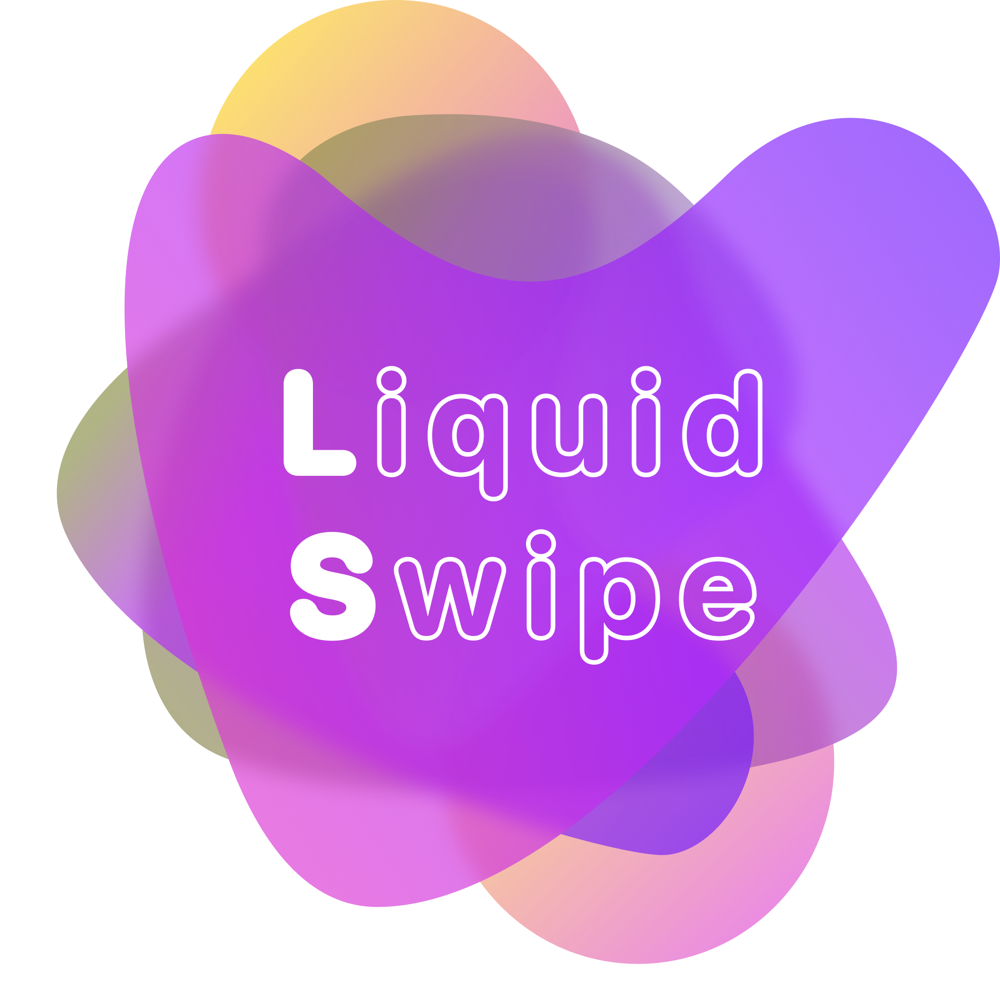

<p align="center"> 
    </img>
</p>

<h1 align="center"> 🚀 React LiquidSwipe</h1> 
<h3 align="center"> Very smooth component transition animation with liquid swipe effect. </h3>

<p align="center">
  <a href="http://hits.dwyl.com/ashutosh1919/react-liquidswipe"></a>
  <!-- ALL-CONTRIBUTORS-BADGE:START - Do not remove or modify this section -->
[](#contributors-)
<!-- ALL-CONTRIBUTORS-BADGE:END -->
  <a href="https://nodejs.org/en/blog/release/v12.18.3/"></a>
  <a href="https://www.npmjs.com/package/npm/v/6.14.6"></a>
  <a href="https://www.gatsbyjs.com/"></a>
  <a href="https://github.com/prettier/prettier"></a>
  <br/>
  <a href="https://app.netlify.com/sites/liquidswipe/deploys"></a>
  <a href="https://travis-ci.org/badges/badgerbadgerbadger"></a>
  <a href="http://badges.mit-license.org/"></a>
  <a href="https://github.com/ashutosh1919/react-liquidswipe/commits/main"></a>
  <a href="http://badges.mit-license.org/"></a>
  <a href="https://liquidswipe.netlify.app/"></a>
  <a href="https://img.shields.io/badge/price-free-ff69b4"></a>
</p>

<p align="center">Loved the project? Please consider <a href="https://www.paypal.com/paypalme/devsense19">donating</a> to help it improve!</p>

<p align="center"> 
    <a href="https://liquidswipe.netlify.app/" target="_blank">
    </img>
  </a>
</p>

:star: Star us on GitHub — it helps!  
To view a live example, [click here](https://liquidswipe.netlify.app/)

**React LiquidSwipe** is created using physics based animation libraries `react-spring` and `react-use-gesture`.

# Use in your website ✏️

Liquid swipe effect is created considering reusability in mind. As of now, there is no `npm` or `yarn` package that you can install because there are several major issues with this package and they are mentioned in the later section of this file. Once, those errors are addressed, we can wrap the component as `npm` or `yarn` package.

If you want to use this animation in your website, you can clone the repository and you can copy the file `src/components/liquidswipe.js` in your project.

To use the component, your code should look like below.

```javascript
import { LiquidSwipe } from '<relative-path-of-liquidswipe.js>';
...
export const YourComponent = () => {
    var componentsToRender = [] // Add components you want to render.
    var backgroundColors = [] // Add background colors for each component.
    ...
    return (
        ...
        <LiquidSwipe
            components={componentsToRender}
            colors={backgroundColors}
        />
        ...
    );
}
```

As of now, the mass and tension of the animation drag is constant and is defined in `liquidswipe.js` file but it may be a changeable parameter in the future version.

If you think that this documentation is not enough for you to understand, I have given other resources links in the `Important Links` section.

# Technologies Used 🛠️

- [GatsbyJS](https://www.gatsbyjs.com/)
- [React Spring](https://www.react-spring.io/)
- [React UseGesture](https://use-gesture.netlify.app/)
- [Styled Components](https://styled-components.com/)
- [Prettier](https://prettier.io/)
- [Theme UI](https://theme-ui.com/)
- [React Icons](https://react-icons.github.io/react-icons/)

# 3D Clay Device Illustrations 🍥

- [Shapefest](https://www.shapefest.com/)

# Important Links 📑

- [Github Repository - It contains the ReactJs implementation of LiquidSwipe](https://github.com/ashutosh1919/react-liquidswipe)
- [Behance Design]()
- [Dribbble Shot]()

# Caution ☠️

This project is still under development and has many issues with it. We have only achieved animation. We need to handle the side effects which it has generated. So, I would humbly suggest you not to use this animation in below cases.

- SVG clip-path is the parent of everything, so we can only see the UI. We can't interact with it (Buttons and other UI elements will not be clickable).
- The animation uses dynamic rendering. So, globally rendered background colors by any theming library (styled-components, emotion, theme-ui) will not work. You can use theming libraries for all purposes other than changing colors.
- Currently it is not working in mobile and tablet screens since click is not available and tap animation code has to be added.

If you think you can solve any of the above problems then we will highly appreciate you to raise the pull request.

# License 📄

This project is licensed under the MIT License - see the [LICENSE.md](https://github.com/ashutosh1919/react-liquidswipe/blob/main/LICENSE) file for details.
You can use this project for personal as well as commercial purposes. But if you think you have modified the project and built something really good, we will humbly request you to raise the pull request and share with the opensource community.

# Contributing 💡

If you can help us with these. Please don't hesitate to open an [pull request](https://github.com/ashutosh1919/react-liquidswipe/pulls) or [issue](https://github.com/ashutosh1919/react-liquidswipe/issues). If you want to know about how to create pull request, then please refer to [this blog](https://opensource.com/article/19/7/create-pull-request-github).

I have mentioned issues with the current implementation in the Caution section. We are highly appreciating you to raise the pull request to resolve some/all the issues.

# Donate 💉

I open-source almost everything I can, and I try to reply to everyone needing help using these projects. Obviously, this takes time. You can use this project for personal and commercial purpose for free.

However, if you are using this project and happy with it or just want to encourage me to continue creating stuff, there are few ways you can do it :-

- Giving proper credit when you use this on your project, linking back to it :D
- Starring and sharing the project 🚀
- You can make one-time donations by clicking the buttons below. I'll probably buy an amazing workstation which will help me build more aggressively.

[](https://www.paypal.com/paypalme/devsense19) <a href="https://www.buymeacoffee.com/devsense19" target="_blank"></a>

# Contributors ✨

Thanks goes to these wonderful people ([emoji key](https://allcontributors.org/docs/en/emoji-key)):

<!-- ALL-CONTRIBUTORS-LIST:START - Do not remove or modify this section -->
<!-- prettier-ignore-start -->
<!-- markdownlint-disable -->
<table>
  <tr>
    <td align="center"><a href="https://github.com/ashutosh1919"><br /><sub><b>Ashutosh Hathidara</b></sub></a><br /><a href="https://github.com/ashutosh1919/react-liquidswipe/commits?author=ashutosh1919" title="Code">💻</a> <a href="https://github.com/ashutosh1919/react-liquidswipe/commits?author=ashutosh1919" title="Documentation">📖</a></td>
  </tr>
</table>

<!-- markdownlint-restore -->
<!-- prettier-ignore-end -->

<!-- ALL-CONTRIBUTORS-LIST:END -->

This project follows the [all-contributors](https://github.com/all-contributors/all-contributors) specification. Contributions of any kind welcome!

# References 👏🏻

- [Cuberto Design Agency has created an original design concept](https://dribbble.com/shots/10680562-UI-Design-Course-3-Liquid-Swipe-After-Effects-Animation-2020)
- [React Native implementation by William Candillon](https://www.youtube.com/watch?v=gLopy2MCAqM)
- [A codepen by Yugam](https://codepen.io/pizza3/pen/LYGQOBo)
